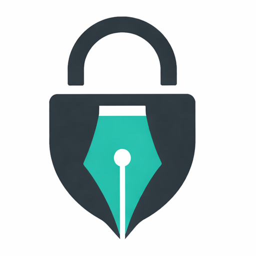

# ✒️ Open Waqf Signer (الموقّع)

> **Secure. Offline. Verifiable.**
> A privacy-first PDF signer with cryptographic integrity checks.

<div align="center">
<a href="https://sign.open-waqf.org">

</a>
</div>

Open Waqf Signer allows users to sign, edit, and **verify** PDF documents directly in their browser. It is built on the
principles of **Amanah** (Trust) and **Privacy**.

Unlike other free tools, **no data is ever uploaded to a server**. All cryptographic processing happens locally on your
device.

---

## 🌟 Key Features

### 🛡️ Security & Trust

* **Zero-Knowledge:** Documents never leave your device (RAM-only processing).
* **Dual-Layer Verification:**
    1. **Metadata Check (Internal):** Instantly identifies files signed by the app.
    2. **Strict Integrity Check (External):** Uses SHA-256 hashing to prove mathematically that a document has not been
       tampered with since signing.
* **Audit Trail:** Automatically appends a verification page with a **QR code**, Event Log, and Digital Fingerprint.

### 🤝 Multi-Party Workflows

* **The "Handover" Protocol:** Securely pass documents between multiple signers (e.g., You -> Manager -> Client).
* **Pre-Sign Validation:** When you open a document signed by someone else, the app automatically detects it and asks
  you to verify their signature *before* you add yours.

### ✍️ Professional Tools

* **Natural Ink:** Smooth, pressure-sensitive signature drawing.
* **Smart Annotation:** Add Names, Dates, Initials, Stamps, and Free Text.
* **History:** Full Undo/Redo support (`Ctrl+Z`, `Ctrl+Y`).
* **Layout Control:** Drag, resize, and position elements with precision.

### 🌍 Universal Access

* **Offline First (PWA):** Installs as a native app on Android, iOS, Windows, and Mac.
* **Multilingual:** Native support for **English**, **Arabic (RTL)**, and **French**.

---

## 🛡️ Privacy & "No Tracking" Promise

We believe in **Data Sovereignty**.

* **No Uploads:** Your PDF never touches our cloud.
* **No Profiling:** We do not use cookies or trackers to build user profiles.
* **Usage Counting:** We use privacy-preserving telemetry (e.g., Plausible/Umami) solely to count aggregate usage (
  e.g., "100 documents signed today") to ensure the project remains sustainable. No personal data is ever collected.

---

## 🧪 Engineering & Stability

We don't just "hope" the code works; we prove it before every release.

* **Automated Audit (The Robot):** We use **Playwright** to run end-to-end tests simulating real user behavior.
* **Coverage:**
    * ✅ **Cryptography:** Verifies that SHA-256 hashes are calculated correctly.
    * ✅ **Workflows:** Simulates Alice signing, downloading, and Bob verifying the file.
    * ✅ **Deep Linking:** Checks that QR codes (`?id=...`) correctly open the Verification Tool.
    * ✅ **Internationalization:** Ensures RTL layouts (Arabic) render correctly.
* **CI/CD Guardrails:** Deployment is physically blocked by GitHub Actions if any test fails, ensuring no broken code
  ever reaches production.

---

## 🚀 Workflows: How to Sign & Verify

We use an **"External Key"** model to ensure document integrity without storing your data on a central server.

### Scenario A: The "Handover" (Two Parties Signing)

1. **Person A (Alice)** signs the document.
    * *System generates Hash: `a1b2...`*
    * Alice sends the PDF + Hash to **Person B (Bob)**.
2. **Person B (Bob)** opens the PDF in Open Waqf Signer.
    * 🚨 **Auto-Detection:** The app detects Alice's signature immediately.
    * **Verify:** Bob enters Alice's hash to confirm the file wasn't tampered with during transit.
3. **Bob Signs:** Once verified, Bob adds his signature and saves.
    * *System generates a NEW Hash: `f9e8...`* that secures both signatures.

### Scenario B: Verification (The Receiver)

Anyone receiving a signed document can verify it in two ways:

#### Option 1: One-Click Scan (QR Code)

Every signed PDF includes an **Audit Page** at the end.

1. Scan the **QR Code** on the last page.
2. Or click the **Verification Link** (if viewing digitally).
3. **Result:** The app opens instantly and validates the document ID against the digital fingerprint.

#### Option 2: Manual Check (Strict)

1. Go to **Verify Mode** in the app.
2. Drop the signed PDF.
3. Paste the **Security Hash** provided by the sender.
    * ✅ **"SECURE VERIFIED":** The document is 100% authentic.
    * ❌ **"MISMATCH":** The document has been altered (even by 1 byte).

---

## 🏗️ Architecture

* **Core:** TypeScript, Vite, Lit (Web Components).
* **Native Layer:** Capacitor (for Android/iOS).
* **Testing:** Playwright (End-to-End & Crypto Logic).
* **PDF Engine:** `pdf-lib` (modification) & `pdfjs-dist` (rendering).
* **Cryptography:** Native `crypto.subtle` API for SHA-256 hashing (no external libraries).
* **Storage:** `IndexedDB` (for preferences only). Files are transient.

---

## 🚀 Getting Started

### Prerequisites

* Node.js 20+
* Android Studio (only if building the APK)

### 1. Installation

```bash
npm install
# Install Capacitor dependencies for Android
npx cap sync

```

### 2. Development (Browser)

Runs the app in "Web Mode" with Hot Module Replacement (HMR).

```bash
npm run dev

```

### 3. Run Tests (The Audit)

Runs the Playwright robot to verify all core features (Sign, Verify, Handover).

```bash
# Installs browsers if running for the first time
npx playwright install

# Run the test suite
npm test

```

### 4. Build for Production (PWA)

Compiles TypeScript to optimized, offline-ready JS in `dist/`.

```bash
npm run build

```

---

## ⚠️ Disclaimers

### Visual vs. Digital Signatures

Open Waqf Signer applies a **Cryptographically Linked Electronic Signature**.

* ✅ **Valid for:** Business contracts, invoices, internal approvals, waivers, and general agreements.
* ❌ **Not for:** Scenarios requiring **eIDAS Qualified Electronic Signatures (QES)** that mandate a specific hardware
  token (Smart Card/USB) issued by a government authority.

### Performance Limits

* **Recommended:** Files under **25MB**.
* **Large Files:** Since processing occurs in your browser's RAM, files larger than 50MB may cause the tab to crash on
  older mobile devices.

---

<div align="center">
<p><em>Built with ❤️ for the Ummah and Humanity.</em></p>
<p><small>Released under Polyform Noncommercial License 1.0.0</small></p>
</div>